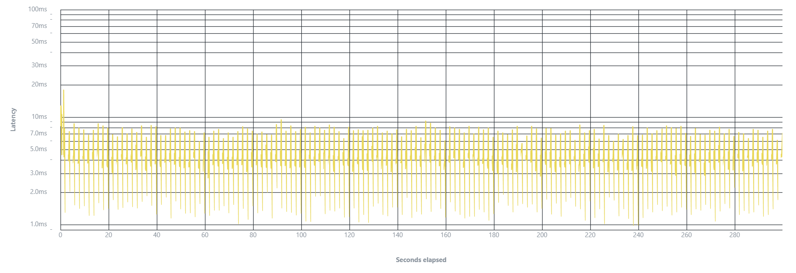

# Avito Intership Autumn 2025

Заявка от:
Васильев Савелий 
ust1vasiljev@yandex.ru 

## Стек проекта
- ЯП – Go v1.25.3
- БД – PostgreSQL 17
- Библиотеки: chi, sqlx, golang-migrate, go-transaction-manager, slog
- Сторонние библиотеки: pytest

## Инструкция по запуску

В директории проекта лежит Makefile с набором команд:
```makefile
start                 # поднимает проект
generate-jwt          # генерирует валидные JWT-токены
test-unit             # запускает unit-тесты
test-integration      # запускает интеграционные тесты
test                  # запускает все тесты
lint                  # запускает линтеры
```

Чтобы поднять проект, нужно заполнить `.env`, пример заполнения показан в файле `.env.example`.

```
CONFIG_PATH=./config/prod.yaml
DATABASE_URL=postgres://user_name:your_password@db:5432/db_name?sslmode=disable

ADMIN_JWT_SECRET=admin_secret_key
USER_JWT_SECRET=user_secret_key  

POSTGRES_DB=db_name
POSTGRES_USER=user_name
POSTGRES_PASSWORD=your_password
```

Далее, достаточно выполнить команду `make start` с установленными `Docker` и `docker compose`.

Обратите внимание, что `make start` вызывает новую команду `docker compose up`, а не `docker-compose up`.

## Допущения в проекте

### Аутентификация
В спецификации API я увидел, что почти все эндпоинты имеют неописанные UserToken и AdminToken. В ТЗ ничего про аутентификацию сказано не было, поэтому были приняты следующие решения:
1. Скрипт в `./cmd/token-generator` генерирует валидные USER_TOKEN и ADMIN_TOKEN, которые нужно передавать в хедер Authentication для корректного выполнения запросов. Токены можно сгенерировать с помощью команды `make generate-jwt`.

2. В `.env` файле находятся две переменные окружения: `ADMIN_JWT_SECRET`  и `USER_JWT_SECRET`. Это подписи JWT, которые используются в приложении и в генераторе токенов. НЕ РЕКОМЕНДУЮ МЕНЯТЬ ЭТИ ЗНАЧЕНИЯ (либо поменять и в приложении, и в генераторе).

### Флаг NeedMoreReviewers у PR'а
Было принято решение убрать этот флаг из модели пул-реквеста, так как он никак не влияет на логику, описанную в ТЗ и в спецификации. (сейчас увидел, что из ТЗ он тоже пропал)

### Эндпоинт на создание команды публичный
В спецификации указано, что запрос на добавление команды публичный. Не очень понимаю логику такого решения, но оставил как есть.

### Healthcheck и статистика
В спецификации вскользь упоминается Healthcheck, но в эндпоинтах я его не обнаружил, поэтому сделал супер-базовую ручку.
В качестве дополнительного задания был реализован эндпоинт `/stats`, который собирает статистику о пользователях и количестве пул-реквестов в базе. 
Обновленная спецификация лежит по пути `/docs/final.yml`

### Валидация и внутренние ошибки
В спецификации не рассмотрены коды ошибок при ошибках валидации пользовательского ввода или внутренних ошибок.
Были приняты следующие решения:
- Ошибки валидации приходят с кодом 400
- Внутренние ошибки сервера приходят с кодом 500
Обновленная спецификация лежит по пути `./docs/final.yml`

### Интеграционное тестирование
Интеграционные тесты написаны с на библиотеке `pytest` на языке `Python`. Чтобы запустить интеграционные тесты не нужно устанавливать зависимости, все поднимается в `docker-compose.test.yaml`, с тестовой БД, приложением, и `python`-контейнером, в котором выполняются тесты. Запустить можно с помощью `make test-integration`.

### Нагрузочное тестирование
Нагрузочное тестирование было проведено с помощью утилиты `vegeta`. Краткая сводка по результатам тестирования и график можно посмотреть ниже, либо в файле `vegeta-plot.png`.

- Duration: 5 minutes
- Rate: 5 req/s (согласно ТЗ)

Результаты Load Test:
- Requests
  total = 1500, rate = 5.00, throughput  = 3.01
- Duration
  total = 5m0s, attack =  5m0s, wait = 7.165ms
- Latencies    
	- min = 982.959µs, 
	- mean = **4.082ms**,
	- 50 = 3.799ms, 
	- 90 = 6.336ms, 
	- 95 = 7.544ms, 
	- 99 = 8.343ms, 
	- max = 17.889ms 
- Bytes In      
  total = 294563, mean = 196.38
- Bytes Out   
  total = 176700, mean = 117.80
  
